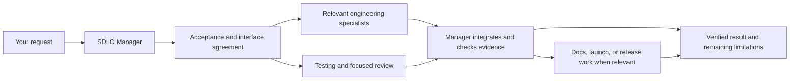

# Codex SDLC team for VS Code

**22 roles, including a coordinating manager, each with a skill and native agent.** This toolkit covers planning, React, backend APIs, databases, feature delivery, debugging, cleanup, testing, security, compliance, repository knowledge, performance, documentation, marketing, releases, and incidents.

Version 3 adds compliance, repository mapping, and reusable project knowledge, with shorter discovery instructions and selective context loading. It retains specialist handoffs, interface agreements, acceptance evidence, and the shell installer. Each specialist also works on its own. The manager brings in the roles the task needs and verifies their combined result.

## Install with one command

Use this repository or an extracted copy of the toolkit ZIP. Open its folder in VS Code, open the integrated terminal, and run:

```sh
bash install.sh
```

This installs for your user account, making the toolkit available across projects. It requires **Python 3.11+** and Bash; the script checks Python and explains what to do if it is missing. There are no pip dependencies, downloads, or sudo steps.

Install the official [Codex extension](https://learn.chatgpt.com/docs/codex/ide), sign in, and start a **new Codex conversation in your application repository**. Then send:

```text
$sdlc-manager Inspect this repository and its existing checks.
Implement [describe your change]. Use the relevant specialists, agree on
shared interfaces, give each file one writer, and verify the integrated result.
```

Already installed an earlier version? Run `bash install.sh --update` from this updated toolkit folder. If you previously installed into one project, use the same `--project` path when updating.

### Install for just one repository

```sh
bash install.sh --project "/absolute/path/to/your-app"
```

The target must already exist. The command can be run from any directory:

```sh
bash "/path/to/this-toolkit/install.sh" --project "$PWD"
```

Choose personal or project scope to avoid duplicate skills. Review the changes before installing with `--dry-run`.

### Check the installation

```sh
bash install.sh --doctor
# For a project installation:
bash install.sh --project "/absolute/path/to/your-app" --doctor
```

The diagnostic checks installed content, native agent TOML, the ownership record, and whether the target's Codex config explicitly disables subagents. It does not change files. A nonzero exit means missing, different, invalid, or disabled content needs attention. An intentionally customized file can differ without being broken; compare it before updating.

In a fresh Codex chat, type `$sdlc-manager` or `/skills` to check skill discovery. To verify actual agent dispatch, ask:

```text
Use sdlc_review as a separate agent to inspect this repository's structure
without changing files. Wait for its result and report what it inspected.
```

A successful file diagnostic does not prove extension loading, account access, or runtime delegation.

### Platforms and VS Code environments

- **macOS/Linux:** run the Bash command in the VS Code terminal.
- **Windows:** use WSL or Git Bash for the `.sh` entry point. With native PowerShell, the equivalent is `py -3 scripts/install.py --user` using Python 3.11+.
- **Knowledge persistence on Windows:** use WSL. The memory helper requires no-follow, directory-relative filesystem operations for storage and evidence access; unsupported Python/filesystem environments fail safely. The installer itself does not require those operations.
- **WSL, SSH, or containers:** install in the same environment where Codex runs. A host-machine installation does not copy files into a remote environment.
- **Custom Python location:** use `SDLC_PYTHON="/path/to/python3" bash install.sh`.

## How the team works together



The [shared collaboration contract](shared/collaboration.md) gives every specialist the same coordination rules:

1. **Bound the assignment:** outcome, acceptance IDs, permitted files, dependencies, and expected evidence.
2. **Agree on interfaces:** producers and consumers share data shapes, authorization, errors, and compatibility assumptions before parallel edits.
3. **Return a handoff:** actual artifacts and checks, unresolved issues, contract changes, and the next owner.
4. **Accept or revise:** the receiving specialist or manager inspects the evidence and accepts it, requests a bounded repair, or identifies the blocker.
5. **Verify integration:** the manager checks the combined behavior and updates evidence after repairs.

For example, the backend agent agrees on a saved-search API contract with React and data owners. Testing derives cases from the acceptance criteria. Documentation describes the verified behavior; marketing uses supported claims. A late response-shape change goes back to the affected owners before the manager declares completion.

The manager keeps a small bug fix small. It does not invoke every role, create unnecessary documents, or require every specialist's approval. Work remains inside the user's requested scope and existing authorization.

## Your specialists

| Skill | Specialist | Use it for |
| --- | --- | --- |
| `$sdlc-manager` | Overall manager | Scope, delegation, integration, completion |
| `$sdlc-product` | Product strategist | Requirements, priorities, acceptance criteria |
| `$sdlc-architecture` | Software architect | Boundaries, technical decisions, tradeoffs |
| `$sdlc-ux` | UX and accessibility | Flows, interaction states, keyboard usability |
| `$sdlc-react` | React engineer | Components, hooks, state, rendering, forms |
| `$sdlc-backend` | Backend/API engineer | Services, contracts, validation, authorization |
| `$sdlc-data` | Database engineer | Schemas, migrations, queries, integrity |
| `$sdlc-feature` | Feature engineer | New functionality and enhancements |
| `$sdlc-debug` | Debugging specialist | Broken behavior, regressions, root causes |
| `$sdlc-refactor` | Refactoring specialist | Cleanup, duplication, technical debt |
| `$sdlc-testing` | Test engineer | Behavior tests, regressions, test reliability |
| `$sdlc-security` | Security engineer | Threats, vulnerabilities, remediation |
| `$sdlc-review` | Code reviewer | Independent, actionable change review |
| `$sdlc-performance` | Performance engineer | Profiling, bottlenecks, measured improvement |
| `$sdlc-devops` | DevOps engineer | CI/CD, builds, environments, infrastructure |
| `$sdlc-release` | Release manager | Readiness, rollout, rollback |
| `$sdlc-docs` | Documentation specialist | User guides, developer docs, examples |
| `$sdlc-marketing` | Product marketer | Positioning, launch copy, growth experiments |
| `$sdlc-incident` | Reliability/incident engineer | Incident triage, recovery, prevention |
| `$sdlc-compliance` | Compliance engineer | Applicable obligations, controls, evidence, gaps |
| `$sdlc-map` | Repository mapper | Structure, important flows, commands, invariants |
| `$sdlc-memory` | Knowledge curator | Reuse verified findings and refresh stale notes |

Use the skill in your current conversation, such as `$sdlc-react`, or ask the manager to delegate to its native agent, `sdlc_react`. The skill contains the specialist workflow; the agent supplies the role for a separate delegated session. Each skill names the relevant peers and the information it needs from them.

The manager stays in the parent conversation. If a named role cannot be selected, it can assign the corresponding skill to a general subagent. If delegation is unavailable, it performs the workflows sequentially and reports that review was not independent. Parallel workers get disjoint write ownership; shared files have one owner.

Native agents inherit your model, reasoning settings, and permissions. They do not run continuously. Subagent configuration and behavior follow the [official custom-agent documentation](https://learn.chatgpt.com/docs/agent-configuration/subagents). The package does not choose a model or change your configuration.

## Keep useful knowledge and spend less context

The manager reuses verified task context before searching again. On repeat visits,
`$sdlc-memory` retrieves a compact project index and only the matching notes.
`$sdlc-map` traces the relevant repository area when it is unfamiliar, recording
entry points, important flows, trust boundaries, commands, coupling, and pitfalls.
A small edit does not trigger a full remap or a team of agents.

Knowledge is stored in **`.sdlc/knowledge.json` inside the repository**. Notes carry
source-file hashes, save/update timestamps, expiry, and Git provenance when available.
Changed, missing, or expired evidence is flagged; stale bodies are withheld by
default. Saved facts are evidence to verify, not instructions or authorization.
One owner merges worthwhile lessons after work instead of saving whole transcripts.

```text
$sdlc-map Map the important parts of this repository for future work.
Trace the main flow, identify invariants and checks, and save concise,
source-linked knowledge through $sdlc-memory.

$sdlc-manager Use current relevant project knowledge first. Implement [change],
inspect changed evidence, and save only useful verified lessons afterward.

$sdlc-compliance Assess this change against [our policy/framework]. Establish
scope and applicability, then map requirements to evidence, gaps, and owners.
```

The memory helper is local, uses Python's standard library, and needs no database
service or API key. It stores curated text, not source-file contents. Keep secrets,
customer data, raw logs, and legal conclusions out of notes. Its checks do not prove
that a summary is true or that untracked dependencies have not changed.

Read the [knowledge and efficiency guide](docs/KNOWLEDGE.md) for commands, bounds,
freshness rules, and deletion. Installation and uninstall do not remove project
knowledge. Review `.sdlc/` before committing it; this toolkit repository ignores it.

Shorter metadata and selective reads reduce avoidable context, following
[OpenAI's guidance on progressive disclosure](https://developers.openai.com/blog/rethinking-skills-and-prompts-for-gpt-6-astra).
This is a project knowledge cache, not a claim of provider-side prompt caching
or a guaranteed token-cost reduction. Use `python3 scripts/context_report.py`
to inspect static character counts; actual usage depends on the task and model.

## Prompts you can use

**Build a feature across layers**

```text
$sdlc-manager Implement saved searches. Establish testable acceptance criteria,
coordinate React/API/data boundaries, and include the necessary tests and docs.
```

**Find and repair broken behavior**

```text
$sdlc-debug Find why the settings dialog sometimes saves the wrong values.
Establish the cause, fix it, and verify the original failure and nearby behavior.
```

**Improve a React flow**

```text
$sdlc-react Add filtering and pagination using this project's existing approach.
Handle pending, empty, error, keyboard, and stale-response behavior.
```

**Review with independent specialists**

```text
$sdlc-manager Review this branch against main. Use separate security and testing
agents where available, wait for both, and return actionable findings with evidence.
```

**Clean up without changing behavior**

```text
$sdlc-refactor Simplify this module. Identify callers and behavior to preserve,
keep the patch focused, and verify compatibility.
```

**Prepare a launch**

```text
$sdlc-manager Prepare release readiness, usage documentation, and launch copy for
this completed feature. Have the specialists share verified capability and rollout
information. Keep the work to local drafts and readiness evidence.
```

For automatic coordination on substantial tasks, merge the optional snippet in
[Project context](docs/PROJECT-CONTEXT.md) into your existing `AGENTS.md`.

## Update, customize, and remove

```sh
bash install.sh --update --dry-run
bash install.sh --update
bash install.sh --uninstall --dry-run
bash install.sh --uninstall
```

For a project installation, append `--project "/absolute/path/to/your-app"` to each command.

The installer records ownership and content hashes. It checks conflicts before writing and updates only unmodified files it owns. It preserves local edits and identical files that existed before installation. Resolve a conflict by comparing and merging the installed and source versions; there is no force-overwrite switch. Uninstall removes only unchanged owned files; customized files and empty directories may remain.

Customize `skills/<name>/SKILL.md` for specialist behavior, `catalog.json` for titles and starter prompts, and `shared/collaboration.md` for the team contract. The build copies that contract into each skill so installed skills retain their own reference. Do not edit the generated copies or `agents/*.toml` directly.

```sh
python3 scripts/build.py
python3 scripts/validate.py
python3 -m unittest discover -s tests -v
bash install.sh --update
```

Use your project scope on the final command when appropriate. Source edits do not silently update installed copies.

## Installed files

```text
project root or home folder/
├── .agents/skills/sdlc-*/
│   ├── SKILL.md
│   ├── agents/openai.yaml
│   ├── scripts/                     # memory helper, where applicable
│   └── references/                  # collaboration and relevant deeper guidance
└── .codex/
    ├── agents/sdlc_*.toml
    └── sdlc-toolkit-manifest.json
```

These are the [documented Codex skill locations](https://learn.chatgpt.com/docs/build-skills). The installer uses the standard home locations for personal installs. It leaves existing `AGENTS.md`, `config.toml`, editor settings, and application files alone. It rejects symlinked destination components instead of writing through them.

If you use a nonstandard `CODEX_HOME`, use project scope or manually place the generated agents in that configured home; the personal installer uses `~/.codex`. No MCP server is required. Browser or external-service work uses available tools and reports unavailable verification.

## Troubleshooting and quality evidence

- **Python not found:** install Python 3.11+ or set `SDLC_PYTHON`. Nothing is downloaded automatically.
- **Skills missing:** confirm the installation scope and environment, run `--doctor`, reload VS Code, and start a fresh Codex conversation.
- **Skills load but native roles do not:** update the Codex extension and check whether subagents are enabled. Older clients may use a different agent format. The manager's skill-based fallback remains available.
- **Existing files differ:** use `--update` for unmodified older installs; compare customized files manually.
- **Permission denied:** choose a writable project or personal target. The installer does not require sudo.

[Validation results](docs/VALIDATION.md) distinguish file checks, installer tests, and behavioral trials from unverified runtime behavior. [Evaluation scenarios](evals/README.md) provide repeatable prompts and acceptance criteria for assessing routing, handoffs, and scope. Quality is measured by correct decisions and observable outcomes, not the number of instructions or a claim that prompts can guarantee expert results.

The [toolkit repository map](docs/REPOSITORY-MAP.md) explains which files to maintain,
the generation and installation flows, and the important ownership boundaries.
